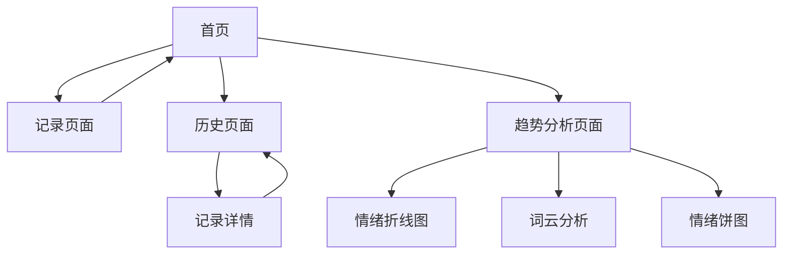

# 情绪记录疗愈应用产品需求文档

## 1. Product Overview
一款专注于情绪记录和心理疗愈的 Web 应用，帮助用户通过每日情绪记录、日记写作和多媒体记录来追踪和改善心理健康状态。
- 解决用户情绪管理和心理健康追踪的需求，通过可视化数据分析帮助用户更好地了解自己的情绪模式。
- 目标是成为用户日常心理健康管理的贴心助手，提供温暖疗愈的数字化体验。

## 2. Core Features

### 2.1 Feature Module
我们的情绪记录疗愈应用包含以下主要页面：
1. **首页**：情绪快速记录、今日心情选择、快捷日记入口。
2. **记录页面**：详细情绪记录、日记编写、照片/录音上传。
3. **历史页面**：日历视图、记录列表、历史数据浏览。
4. **趋势分析页面**：情绪折线图、词云分析、情绪占比饼图。

### 2.2 Page Details

| Page Name | Module Name | Feature description |
|-----------|-------------|---------------------|
| 首页 | 快速记录区 | 提供当日情绪快速选择（开心、难过、焦虑、平静等），一键进入详细记录页面 |
| 首页 | 今日概览 | 显示今日已记录内容摘要，引导用户完善记录 |
| 首页 | 导航菜单 | 提供到历史页面、趋势分析页面的快捷入口 |
| 记录页面 | 情绪选择器 | 提供多种情绪选项（开心、难过、焦虑、平静、愤怒、兴奋等），支持情绪强度调节 |
| 记录页面 | 日记编辑器 | 支持文本输入，提供字数统计，自动保存草稿 |
| 记录页面 | 多媒体上传 | 支持照片上传和录音功能，提供预览和删除操作 |
| 记录页面 | 保存提交 | 记录保存确认，成功反馈，返回首页 |
| 历史页面 | 日历视图 | 月历展示，标记有记录的日期，点击查看当日详情 |
| 历史页面 | 记录列表 | 时间线形式展示历史记录，支持滚动加载和搜索过滤 |
| 历史页面 | 详情查看 | 展示选中日期的完整记录内容，包括情绪、日记、多媒体 |
| 趋势分析页面 | 情绪折线图 | 展示指定时间段内情绪变化趋势，支持时间范围选择 |
| 趋势分析页面 | 词云组件 | 从日记文本中提取高频词汇，生成词云可视化，词汇大小和颜色反映频率 |
| 趋势分析页面 | 情绪占比饼图 | 统计各类情绪出现频次，以饼图形式展示占比分布 |

## 3. Core Process

**主要用户操作流程：**

1. **日常记录流程**：用户进入首页 → 选择当日情绪 → 进入记录页面 → 编写日记内容 → 上传照片或录音（可选）→ 保存记录 → 返回首页

2. **历史查看流程**：用户进入历史页面 → 通过日历选择特定日期或浏览记录列表 → 查看详细记录内容 → 可选择编辑或删除

3. **趋势分析流程**：用户进入趋势分析页面 → 选择分析时间范围 → 查看情绪折线图了解变化趋势 → 通过词云发现关键词汇 → 查看情绪占比了解整体状态

## 4. User Interface Design

### 4.1 Design Style
- **主色调**：奶白色 (#FEFEFE)、雾紫色 (#E6E0F8)、淡蓝色 (#E8F4FD)
- **辅助色**：柔和粉色 (#F8E8E8)、淡绿色 (#E8F8E8)
- **按钮风格**：圆角矩形，具有轻微阴影和渐变效果，营造果冻质感
- **字体**：优雅的无衬线字体，主标题 24px，正文 16px，辅助文字 14px
- **布局风格**：卡片式设计，大量留白，柔和的分割线和阴影
- **图标风格**：线性图标配合填充效果，圆润风格，使用品牌色彩
- **动效**：缓动函数 ease-in-out，过渡时间 0.3-0.5s，微妙的弹性效果

### 4.2 Page Design Overview

| Page Name | Module Name | UI Elements |
|-----------|-------------|-------------|
| 首页 | 快速记录区 | 大尺寸情绪选择按钮，圆形设计，渐变背景，点击有轻微缩放动效 |
| 首页 | 今日概览 | 半透明卡片容器，柔和阴影，内容区域使用奶白背景 |
| 首页 | 导航菜单 | 底部标签栏，图标+文字，选中状态有颜色变化和轻微上移动效 |
| 记录页面 | 情绪选择器 | 网格布局的情绪卡片，每个卡片有对应的颜色和表情图标 |
| 记录页面 | 日记编辑器 | 大面积文本输入框，圆角边框，聚焦时有柔和的边框高亮效果 |
| 记录页面 | 多媒体上传 | 虚线边框的上传区域，拖拽时有颜色变化，上传成功有确认动画 |
| 历史页面 | 日历视图 | 网格布局，有记录的日期用小圆点标记，选中日期有背景高亮 |
| 历史页面 | 记录列表 | 时间线设计，每条记录为卡片形式，左侧有情绪颜色标识 |
| 趋势分析页面 | 情绪折线图 | 柔和的曲线，渐变填充，数据点有悬浮提示，使用品牌色彩 |
| 趋势分析页面 | 词云组件 | 词汇随机分布，大小和透明度体现频率，鼠标悬浮有放大效果 |
| 趋势分析页面 | 情绪饼图 | 柔和的扇形，每个情绪对应不同颜色，有标签和百分比显示 |

### 4.3 Responsiveness
应用采用移动优先的响应式设计，主要针对手机端使用体验优化，同时兼容平板和桌面端。支持触摸手势操作，包括滑动、点击和长按交互。在不同屏幕尺寸下保持一致的视觉层次和交互体验。