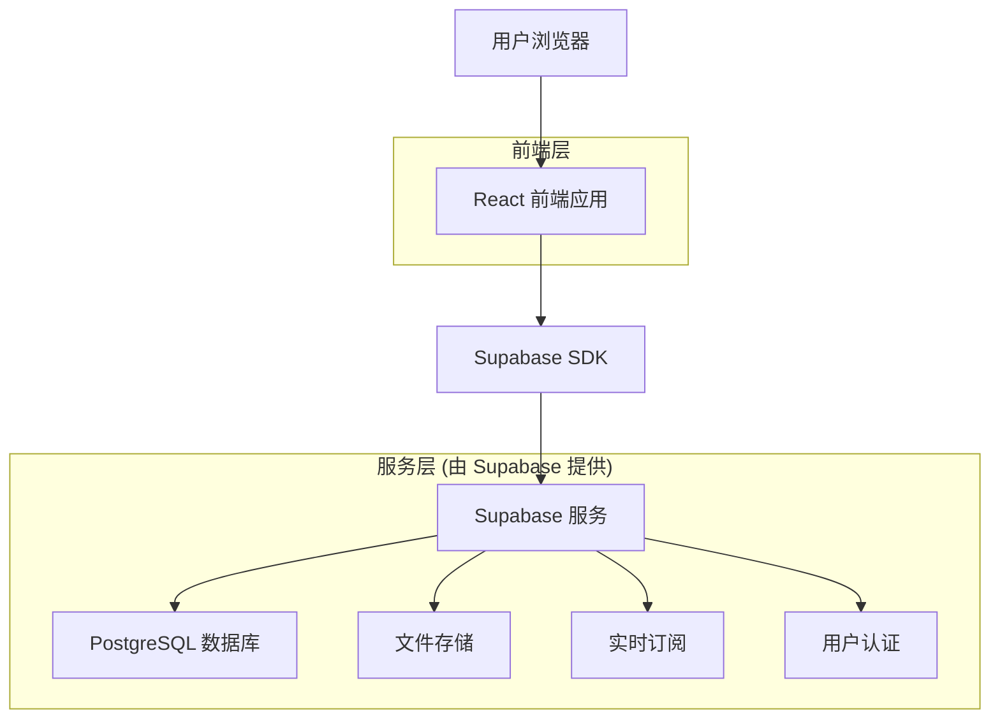
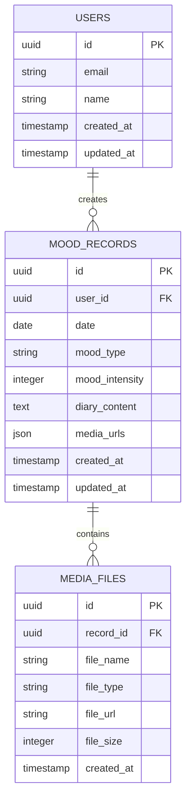

# 情绪记录疗愈应用技术架构文档

## 1. Architecture design



## 2. Technology Description

* **前端**: React\@18 + TypeScript + Vite + TailwindCSS + Framer Motion

* **后端**: Supabase (提供数据库、认证、存储、实时功能)

* **图表库**: Chart.js + React-Chartjs-2 (折线图、饼图)

* **词云**: Wordcloud2.js 或 React-Wordcloud

* **UI组件**: Headless UI + 自定义组件

* **状态管理**: React Context + useReducer

## 3. Route definitions

| Route      | Purpose           |
| ---------- | ----------------- |
| /          | 首页，显示今日情绪快速记录和导航  |
| /record    | 记录页面，详细的情绪记录和日记编写 |
| /history   | 历史页面，日历视图和记录列表浏览  |
| /analytics | 趋势分析页面，情绪图表和数据可视化 |
| /auth      | 用户认证页面（登录/注册）     |

## 4. API definitions

### 4.1 Core API

由于使用 Supabase，主要通过 Supabase Client SDK 进行数据操作，以下为主要的数据操作接口：

**情绪记录相关**

```typescript
// 创建情绪记录
supabase.from('mood_records').insert({
  user_id: string,
  date: string,
  mood_type: string,
  mood_intensity: number,
  diary_content: string,
  media_urls: string[]
})

// 获取用户的情绪记录
supabase.from('mood_records')
  .select('*')
  .eq('user_id', userId)
  .order('date', { ascending: false })

// 获取指定日期范围的记录
supabase.from('mood_records')
  .select('*')
  .eq('user_id', userId)
  .gte('date', startDate)
  .lte('date', endDate)
```

**文件上传**

```typescript
// 上传照片或录音文件
supabase.storage
  .from('mood-media')
  .upload(`${userId}/${fileName}`, file)
```

## 5. Data model

### 5.1 Data model definition



### 5.2 Data Definition Language

**用户表 (users)**

```sql
-- Supabase 自动创建 auth.users 表，我们创建扩展用户信息表
CREATE TABLE public.user_profiles (
  id UUID REFERENCES auth.users(id) PRIMARY KEY,
  name VARCHAR(100),
  avatar_url TEXT,
  timezone VARCHAR(50) DEFAULT 'Asia/Shanghai',
  created_at TIMESTAMP WITH TIME ZONE DEFAULT NOW(),
  updated_at TIMESTAMP WITH TIME ZONE DEFAULT NOW()
);

-- 启用 RLS (Row Level Security)
ALTER TABLE public.user_profiles ENABLE ROW LEVEL SECURITY;

-- 创建 RLS 策略
CREATE POLICY "Users can view own profile" ON public.user_profiles
  FOR SELECT USING (auth.uid() = id);

CREATE POLICY "Users can update own profile" ON public.user_profiles
  FOR UPDATE USING (auth.uid() = id);

-- 权限设置
GRANT SELECT, INSERT, UPDATE ON public.user_profiles TO authenticated;
```

**情绪记录表 (mood\_records)**

```sql
CREATE TABLE public.mood_records (
  id UUID PRIMARY KEY DEFAULT gen_random_uuid(),
  user_id UUID REFERENCES auth.users(id) ON DELETE CASCADE,
  date DATE NOT NULL,
  mood_type VARCHAR(20) NOT NULL CHECK (mood_type IN ('happy', 'sad', 'anxious', 'calm', 'angry', 'excited', 'tired', 'peaceful')),
  mood_intensity INTEGER CHECK (mood_intensity >= 1 AND mood_intensity <= 5),
  diary_content TEXT,
  media_urls JSONB DEFAULT '[]'::jsonb,
  created_at TIMESTAMP WITH TIME ZONE DEFAULT NOW(),
  updated_at TIMESTAMP WITH TIME ZONE DEFAULT NOW()
);

-- 创建索引
CREATE INDEX idx_mood_records_user_date ON public.mood_records(user_id, date DESC);
CREATE INDEX idx_mood_records_mood_type ON public.mood_records(mood_type);
CREATE INDEX idx_mood_records_date ON public.mood_records(date DESC);

-- 启用 RLS
ALTER TABLE public.mood_records ENABLE ROW LEVEL SECURITY;

-- 创建 RLS 策略
CREATE POLICY "Users can manage own mood records" ON public.mood_records
  FOR ALL USING (auth.uid() = user_id);

-- 权限设置
GRANT ALL PRIVILEGES ON public.mood_records TO authenticated;
```

**预生成数据**

```sql
-- 为演示用户插入示例数据
INSERT INTO public.mood_records (user_id, date, mood_type, mood_intensity, diary_content) VALUES
  ('demo-user-id', '2024-01-15', 'happy', 4, '今天天气很好，和朋友一起去公园散步，心情特别愉快。'),
  ('demo-user-id', '2024-01-14', 'calm', 3, '工作比较顺利，晚上看了一本好书，感觉很平静。'),
  ('demo-user-id', '2024-01-13', 'anxious', 2, '明天有重要的会议，有点紧张，但是准备得还算充分。'),
  ('demo-user-id', '2024-01-12', 'excited', 5, '收到了心仪已久的工作offer，太开心了！'),
  ('demo-user-id', '2024-01-11', 'tired', 2, '加班到很晚，身体有点疲惫，需要好好休息。'),
  ('demo-user-id', '2024-01-10', 'peaceful', 4, '周末在家整理房间，听着音乐，感觉很宁静。'),
  ('demo-user-id', '2024-01-09', 'sad', 2, '想起了一些往事，有点难过，但是相信明天会更好。'),
  ('demo-user-id', '2024-01-08', 'happy', 3, '和家人一起吃饭，聊了很多有趣的话题。');
```

**存储桶设置**

```sql
-- 创建媒体文件存储桶
INSERT INTO storage.buckets (id, name, public) VALUES ('mood-media', 'mood-media', false);

-- 创建存储策略
CREATE POLICY "Users can upload own media" ON storage.objects
  FOR INSERT WITH CHECK (bucket_id = 'mood-media' AND auth.uid()::text = (storage.foldername(name))[1]);

CREATE POLICY "Users can view own media" ON storage.objects
  FOR SELECT USING (bucket_id = 'mood-media' AND auth.uid()::text = (storage.foldername(name))[1]);

CREATE POLICY "Users can delete own media" ON storage.objects
  FOR DELETE USING (bucket_id = 'mood-media' AND auth.uid()::text = (storage.foldername(name))[1]);
```

